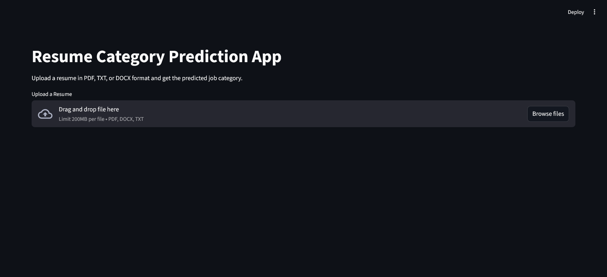
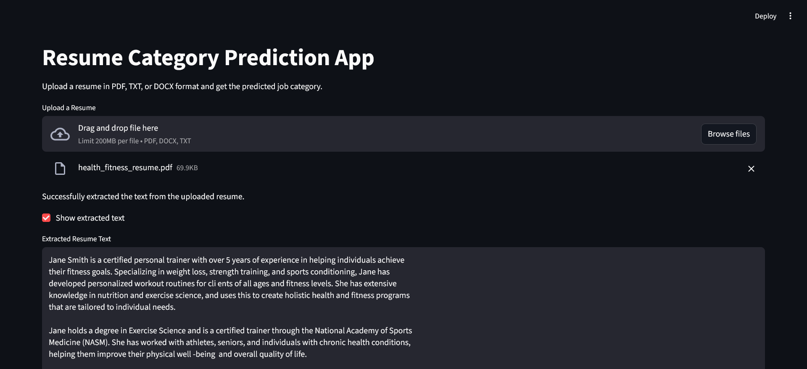

# Resume-Screening-App
Resume Screening App With Python and Machine Learning 

by CO23316 and CO23356
## Directions
1. Clone the repository to your local machine using the command:
   ```
   git clone "https://github.com/BhavyamDhandIsHere/Resume-Screening-App-main.git"
2. Navigate to the project directory:
   ```
    cd Resume-Screening-App
3. Install the required dependencies using pip: 
    ```
    pip install -r requirements.txt
4. Run the application:
    ```
    streamlit run app.py
5.  Your web browser will automatically open to the following Site depicted below:
    
6. Upload your resume in PDF/docx format and click on the "Screen Resume" button to see the results.
7. The application will display the extracted information from your resume, including skills, experience, and education. 
    

# DATASET SOURCE: 
https://www.kaggle.com/datasets/gauravduttakiit/resume-dataset?resource=download
